# Aplicación Financiera Banqui 💰

## 1. **Objetivos iniciales** 📣

Iniciemos hablando de qué es una Fintech...
Una fintech, o en español una tecnología financiera, es cuando en la industria financiera se incluyen procesos tecnológicos e invovadores para automatizar servicios bancarios.

### **¿Cómo nos ayuda?**
Cada día la innovación digital y tecnologica nos ayuda a ahorrar procesos, y qué mejor que ahorrar tiempo en procesos financieros, podríamos tener todo en la palma de la mano y de una manera segura.

En esta oportunidad **Banco Pichincha**, quién actualmente tiene un gran sector del grupo emprendedor peruano, respalda **Banqui**, la nueva fintech que ingresa al mercado para ayudar a nuestros emprendedores peruanos con sus procesos financieros de manera segura, eficaz y sencilla. Sin embargo, en esta ocasión nos proponemos resolver y diseñar esta aplicación con objetivos obtenidos mediante nuestra investigación.

#### Nuestros principales objetivos de cambio, son:
* **Replantear el User Persona**
Banqui desea dirigirse a una población joven y digitalmente nativa.
* **Rediseñar la aplicación** 
Contribuir con los usuarios, ayudandolos con sus procesos acompañado de textos indicativos, sin saturarlos de información.
* **Mejorar el flujo de navegación** 
Realizarlas de manera rápida, sencilla y eficaz.

## 2. Problemas encontrados en el primer diseño de Banqui 🔍
Banqui inició prematuramente, con un diseño básico pero con la intención de cumplir los objetivos de satisfacer las necesidades de sus usuarios. Afortunadamente, llegamos para apoyar en su proceso de transformación. 

Este es el primer prototipo navegable de Banqui. Donde podemos apreciar algunos detalles visuales y de interación como desalineación en el contenido, una navegación poco entendible para el usuario y poca información para una aplicación nueva.

[Prototipo] (https://marvelapp.com/1hj56576/screen/60926857)

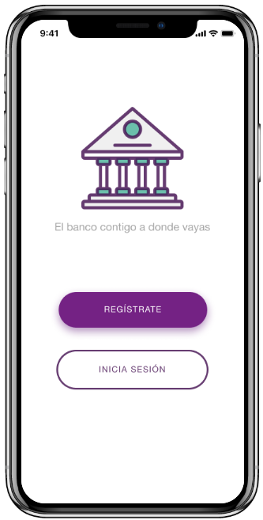
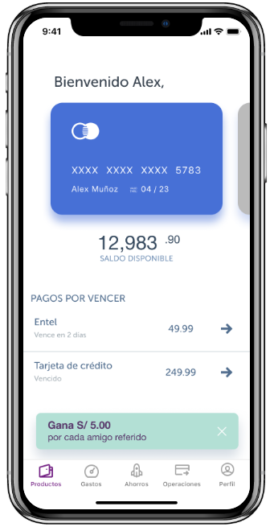
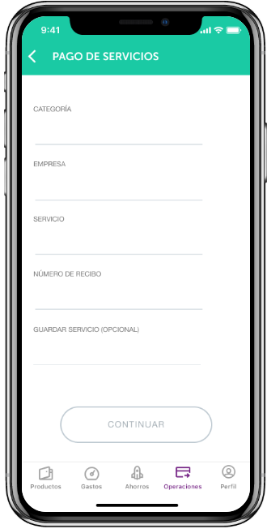
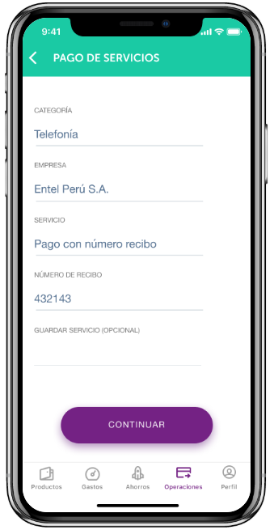
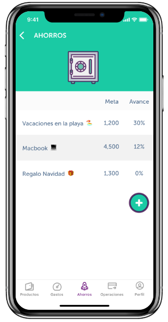
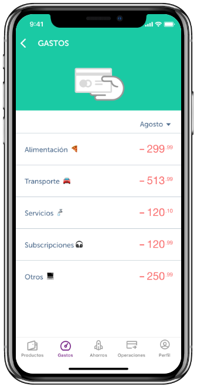

## 3. Problemas encontrados en el testeo de Usuarios 🔍
Realizamos 30 testeos en total. 5 físicas y 30 vía online. Ambas parte de la prueba, mostraron dificultades en la sección de ahorros y gastos. Principalmente en la de ahorros, no comprendían estas secciones ya que son las propuestas innovadoras que Banqui tiene para sus usuarios, también observamos que los usuarios necesitaban automatizar procesos.

### Proceso de investigación
Realizamos entrevistas a usuarios quienes actualmente tienen una app financiera, un trabajo estable y desean empezar a mejorar sus finanzas personales. En base a toda nuestra sintesís, creamos a Adriana Palomino, nuestra User Persona. La cual complementamos con un Costumer Journey Map.

## 4. Nuevos Objetivos 📌

Nuestros principales objetivos con Banqui en base a la sintesis de investigación, son:
* **Seguridad** brindar métodos seguros en cada proceso.
* **Control** contribuir con las metas de los usuarios, ayudandolos con sus pagos y ahorros.
* **Transacciones** realizarlas de manera rápida, sencilla y eficaz.

Este es la nueva propuesta testeada para [Banqui] (https://marvelapp.com/84a6i0j/screen/65863885)

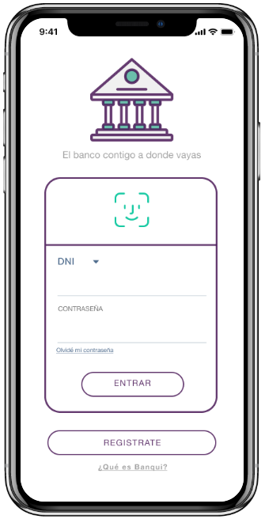
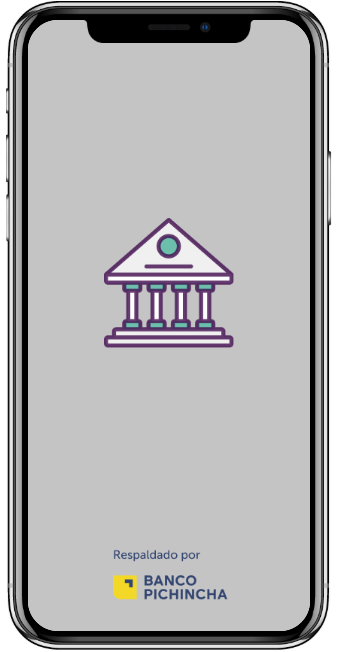
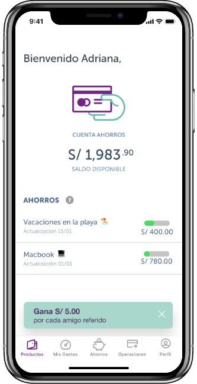
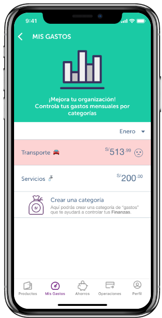
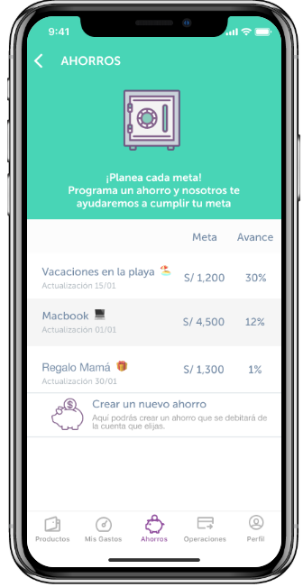
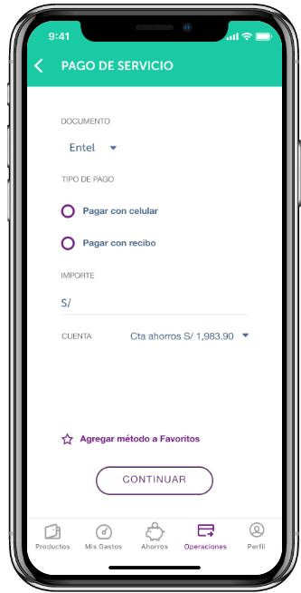
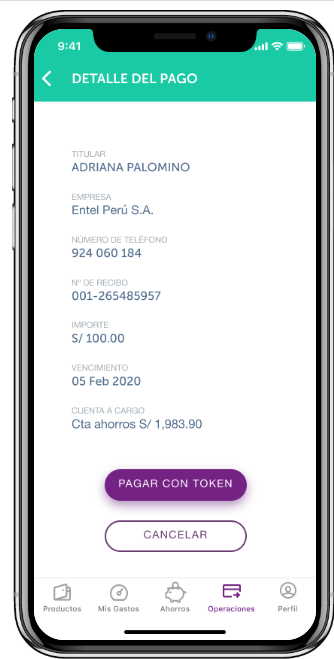
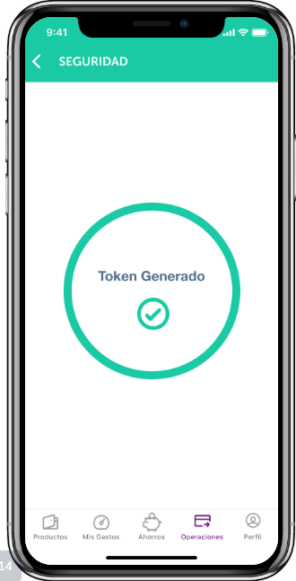
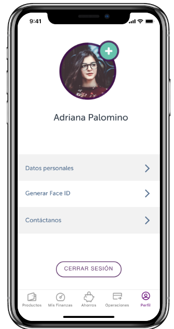

Nos enfocamos en el público con los teléfonos más seguros, quienes prefieren los nuevos métodos de ingreso por lo personal e instranferibles que son. Agregamos el método más eficaz de pago como lo es por token digital. Y automatizamos los procesos de la aplicación para mejor entendimiento del usuario. Los cambios resultaron satifactorios para los usuarios.

## 5. Next Steps 📋
1. Agregar una opción de cancelación de ahorro
2. Agregar gráficas de apoyo en la sección de gastos
3. Agregar un nuevo logo a Banqui
4. Agregar la opción de obtener nuevas cuentas en Banqui.

## 6. Links 💿
[Drive] (https://drive.google.com/drive/folders/1FPnBcaHZ6Un65szc2EQ4mKYjoXE-pkZ2?usp=sharing)
[Loom]

¡Gracias por tomarte el tiempo de leer esta tranformación! 🙋

<!-- # Aplicación financiera

## Preámbulo

El banco más importante del país, siguiendo las tendencias de otros países, está
planeando lanzar un banco 100% digital bajo otro nombre: "Banqui". Su principal
objetivo es tener un banco que sea más cercano a las necesidades del público más
joven del país. Para ello han venido piloteando un app con un número pequeño de
usuarios. Los resultados de este piloto son mixtos, hay algunas cosas que han
sido bien recibidas por los usuarios, y hay otras que se tienen que mejorar aún.

Para poder ayudarlos a entender mejor las necesidades de sus clientes y crear
el mejor banco digital del país han decidido contratar a una consultora de UX,
donde le han asignado este proyecto a ti y otra compañera de Laboratoria.

## Introducción

### Contexto

Durante la primera semana de entendimiento de los requerimientos, el Product
Manager les comparte las hipótesis y preguntas que tienen dentro del equipo:

> Los usuarios que anteriormente han sido clientes de algún banco, nos comparan
  con las aplicaciones de esos bancos, parece que hay cosas que extrañan.

> La aplicación que estamos probando es para iOS, sin embargo, para hacer un
  lanzamiento nacional necesitamos crear un app para Android.

> Nos falta acercarnos un poco más a los usuarios jóvenes, 100% digitales, los
  que usan Netflix, Uber, Spotify, Instagram, entre otros.

### Recursos

En esta carpeta de [Google Drive](https://drive.google.com/drive/folders/1etdcDyoN7C038ti_i4RhavK2DWEAc1yH?usp=sharing) y en los siguientes
links, encontrarán:

- Los user personas
- El user flow del MVP
- El [diseño del app en Figma](https://www.figma.com/file/im1tb4vPyt9bMVlhzqlHIR/S02E01-App-Financiera?node-id=0%3A1)
  , con una guía de componentes y el [Prototipo navegable](https://marvelapp.com/1hj56576/screen/60926857).
- Analytics de los primeros 6 meses del MVP
- Data de uso del MVP de los primeros 6 meses

## Objetivos de aprendizaje

El objetivo principal de este proyecto es que te enfrentes al reto de rediseñar
un producto ya existente. Es muy probable que termines trabajando en productos
existentes y que para tener un buen entendimiento del problema, debas analizar
data de ese producto y complementar esta data con investigación de campo. Para
luego definir una estrategia de producto de acuerdo a los objetivos del negocio,
pero sin dejar de lado los objetivos y necesidades de los usuarios. Puedes leer
sobre el trabajo de un UX Designer en rediseño este [blogpost](https://blog.continuum.cl/preguntas-para-dejar-de-ser-ux-designer-y-empezar-a-ser-un-ux-redesigner-143e5467ec8d).

En este proyecto pondrás en práctica habilidades de: análisis de datos,
investigación de campo, pensamiento crítico, cuestionamiento, síntesis, diseño
de componentes de la interfaz y user testing.

## Consideraciones generales

Como ya habrás notado, gran parte del trabajo de UX tiene relación con el
desempeño de tus habilidades blandas. Estas habilidades nos acompañan a lo largo
de cualquier proyecto y su desarrollo es clave para el éxito. Estas habilidades
no sólo son utilizadas a la hora de entender al usuario, sino a lo largo de toda
la ejecución, es decir desde cómo planificamos hasta nuestra presentación al
cliente.

Anteriormente, nos habíamos concentrado en el desarrollo de tu curiosidad y
empatía, practicado cómo relacionarte con el cliente y el usuario. Siempre debes
pensar quiénes son y qué necesitan, y no enfocarte en lo que tú consideras que
podría ser la solución correcta. Se trata de entender que nosotros no somos el
usuario, y debemos hacer el ejercicio empático de comprenderlo a él y a nuestro
cliente.

Este proyecto, a diferencia de otros, no debes partir desde cero generando un
prototipo, sino investigar lo que el banco ya ha construido y en base a eso
hacer una propuesta. Para esto, te aconsejamos comenzar por investigar
la información que tienes; entender qué datos ya manejas y qué elementos
necesitas averiguar para completar tu proyecto. De esta manera, tu planificación
es muy relevante para comprender la problemática.

Al planificar podrás comprender de qué manera estructurar tu proyecto y qué
elementos debes investigar. Además, te permitirá trabajar de mejor manera con tu
compañera, te aconsejamos que consideres tiempo para poder iterar sobre las
posibilidades de mejora y también para preparar la presentación.

La calidad del proyecto depende totalmente de tu proactividad y autoaprendizaje,
si no conoces plataformas financieras parte por investigar sobre ellas. No
esperes que los contenidos lleguen a ti, más bien busca todo lo que necesites
para poder encontrar la mejor solución.

Parte importante de tu trabajo como UX designer es tomar decisiones.
Efectivamente existen múltiples herramientas que puedes utilizar, debes
comprender para qué y con qué finalidad escoges usar cada una de ellas. Siempre
piensa que debes justificar todo gasto con tu consultora y el cliente, cada
decisión que tomes en el proyecto debe ser fundamentada, no sigas pasos
mecánicos por seguirlos, cuestiónate constantemente.

Por último, considera que la calidad de tu presentación es tan importante como
el proceso completo. Un proyecto que no se aprecia al ser presentado no es un
buen proyecto. Si vas a utilizar una slides frente a un cliente, se prolija en
el diseño de ellos y en la información que entregas, también busca la mejor
manera de mostrar tu demo y por sobre todo prueba antes de presentar frente al
cliente.

## Entrega

El proyecto será entregado en un repositorio de GitHub. En él deberás agregar
lo siguiente:

README.md  detallando:

* Objetivos iniciales del proyecto
* Problemas encontrados tanto a nivel de negocio como a nivel de usuario
* Recomendaciones de próximos pasos para el banco con respecto al app
* De acuerdo al punto anterior, de requerirse cambios y desarrollos nuevos,
  estos deberán ser diseñados y entregados en un prototipo de alta definición.

Un video en Loom de máximo 5 minutos explicando tu documento.
* Estos 5 minutos tienes que utilizarlos para explicar los puntos indicados en
  el `README.md` y para hacer un demo de la solución propuesta.

En las otras carpetas del repositorio o en las carpetas de Google Drive podrás
agregar los documentos complementarios que sustenten tu proceso.

### Hacker edition

Para el hacker edition puedes elegir una o varias de estas opciones:

- Antes de empezar a desarrollar este proyecto, lista cuáles fueron tus
  aprendizajes durante el proyecto 1 y en qué cosas te gustaría mejorar durante 
  el proyecto 2. Al terminar el proyecto 2 vuelve a esta lista y chequea cómo te 
  fue con esos retos, ¿los cumpliste? Muestrános esta lista y esta reflexión
  en un documento adicional (en el formato que prefieras).
- En lugar de usar Github para documentar tu proceso de trabajo, documéntalo en
  su propia web, puedes usar Wix, Instapage, Squarespace, Google Sites o crear
  tu propia web desde 0. 
- Escribe un post en Medium contando tu proceso de investigación.

## Otras consideraciones

### 1) Planeamiento y presupuesto

En el reto con emprendimientos te entregamos una lista de tareas que podías
realizar y le asignamos un valor en puntos a cada tarea. Además, te dimos un
presupuesto de 300 puntos para que los utilices en esas tareas. Para este reto,
la lista de tareas, el valor en puntos de cada tarea y el presupuesto total
de las actividades a realizar lo crearás tú y lo tendrás que sustentar con tu
coach. Adicinalmente, deberás sustentar con tu coach qué entregables harás
llegar al banco al final de tu investigación y por qué. El coach te aprobará
estos entregables o te dará feedback para mejorarlos.

Cuando hagas tu presupuesto y pienses en los entregables recuerda que el tiempo
de desarrollo de este proyecto es de dos semanas. También, recuerda qué partes
te tomaron más tiempo en el desarrollo del proyecto 1 y los aprendizajes que
tuviste al desarrollar el proyecto 1.

### 2) Prototipo de alta fidelidad

Existen varias herramientas que puedes utilizar para crear diseñar el producto,
en este caso el diseño viene en Figma y el prototipo en Marvel, así que puedes
seguir usando esas herramientas. Sin embargo, eres libre de utilizar otras
como Adobe XD e Invision. Para el prototipo intenta utilizar Marvel o Invision,
ya que para el testing tendrás que usar una herramienta llamada
[Maze](https://maze.design/) que funciona mejor con estas.

Recuerda que el diseño que trabajes debe seguir los fundamentos de diseño visual
como: contraste, alineación, jerarquía, entre otros. -->
